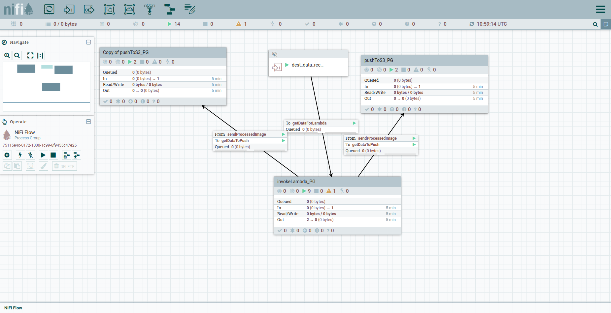
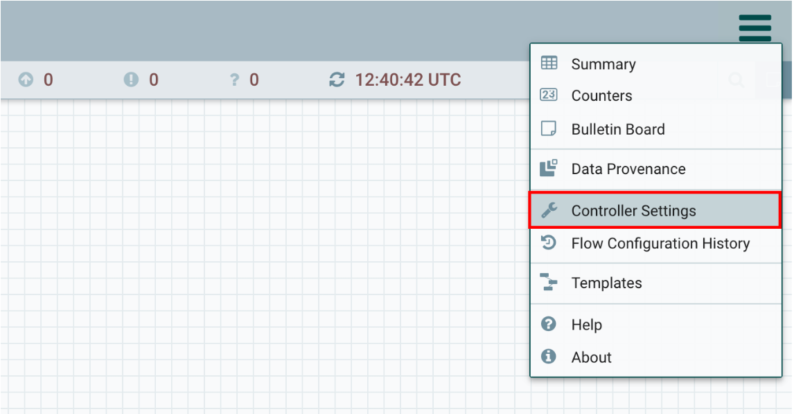
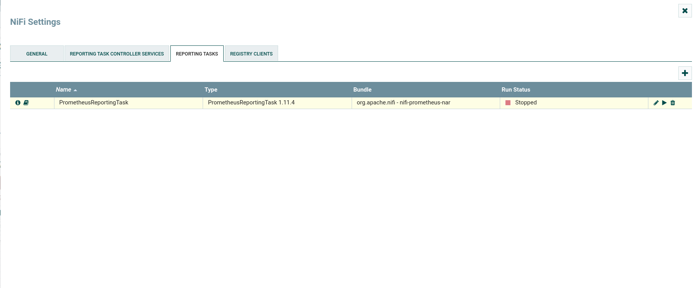
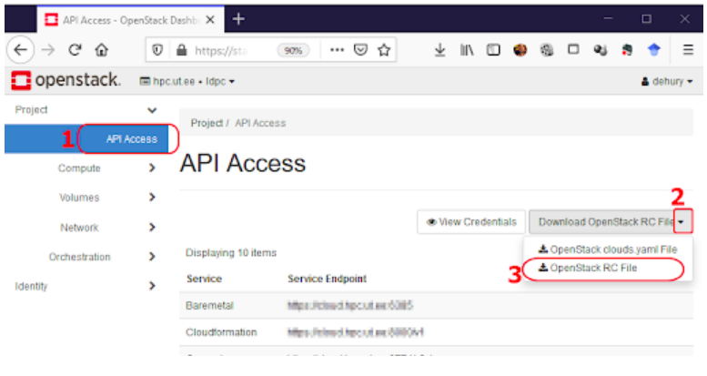
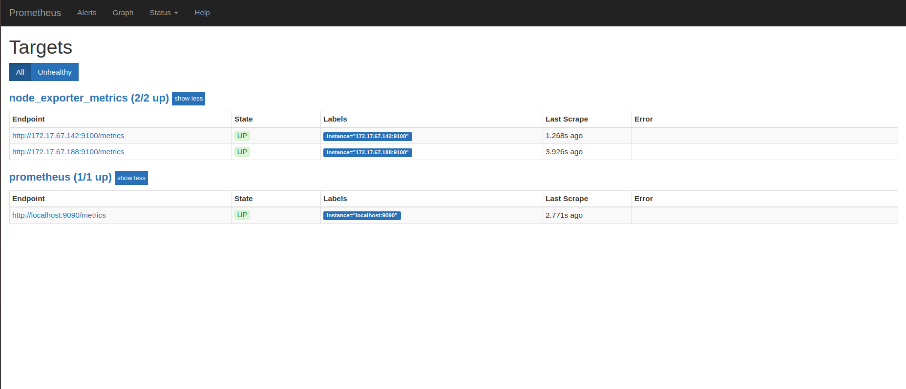

# Validation of the Thumbnail Generation with Data Pipeline Demo Application
The Thumbnail generation with data pipeline demo application is verified by pushing multiple images as a form of loads to the S3Buckets through JMeter. For generating the datasets with multiple images, INRIA Holiday dataset is used. In case of verifying the demo lab application, multiple images are uploaded to the source endpoint i.e. to the source S3Bucket through JMeter. During load testing, we check that the data pipeline services still perform as expected in terms of multiple performance metrics, i.e. load time, throughput, etc. Further, the success rate of the demo lab application is tested by comparing the uploaded images on the source S3Bucket with the thumbnails in the other data end-point or destination S3Buckets.
# Prerequisites
- Deploy the data pipelines for thumbnail gneration by following the steps [here](https://github.com/radon-h2020/demo-lambda-thumbgen-tosca-datapipeline). Latest Version of sources codes for the deployment can be downloaded form [here](https://github.com/mainak89/Data-pipeline-Validation-And-Load-Testing-with-Multiple-images)
- The demo application for thumbnail generation with data pipeline should be deployed.
- Java9
- Apache Jmeter
- aws-java-sdk-s3 JAR 1.11.313 dependencies [jar files](https://jar-download.com/artifacts/com.amazonaws/aws-java-sdk-s3/1.11.313/source-code)

# Upload Images to AWS S3 Bucket using Apache JMeter
- Copy the jar files to JMeterHome/lib/ext/ of Jmeter.
- Create a Test Plan and click on Thread Group.
- Set Number of Threads, Ramp-up period and Loop Count to 1.
- Right click on thread groups and as a JSR233 sampler.
- Select Java as the language in the JSR233 sampler.
- Add the following code in the script section of the sampler.
```
import java.io.IOException;
import java.io.InputStream;
import java.util.Properties;
import java.util.ArrayList;
import java.util.List;
import java.util.Scanner;
import com.amazonaws.auth.AWSSessionCredentials;
import com.amazonaws.auth.AWSStaticCredentialsProvider;
import com.amazonaws.auth.BasicAWSCredentials;
import com.amazonaws.services.s3.AmazonS3;
import com.amazonaws.services.s3.AmazonS3ClientBuilder;
import com.amazonaws.services.s3.model.AmazonS3Exception;
import com.amazonaws.services.s3.model.GetObjectRequest;
import com.amazonaws.services.s3.model.PutObjectRequest;
import com.amazonaws.services.s3.model.PutObjectResult;
import com.amazonaws.services.s3.model.S3Object;
import com.amazonaws.services.s3.model.S3ObjectInputStream;
import com.amazonaws.regions.Regions;
import com.amazonaws.regions.Region;
import com.amazonaws.services.s3.model.ObjectMetadata;
import com.amazonaws.services.s3.transfer.Download;
import com.amazonaws.services.s3.transfer.TransferManager;
import com.amazonaws.services.s3.transfer.TransferManagerBuilder;
import com.amazonaws.services.s3.transfer.Upload;

String accessKey = "xxxxxxx";
String secretKey = "xxxxxxxxx";               
String bucketName = "radon-utr-thumbgen1"; //specify bucketname
String region = "eu-north-1";

BasicAWSCredentials sessionCredentials = new BasicAWSCredentials(accessKey, secretKey);

AmazonS3 s3 = AmazonS3ClientBuilder.standard()
   .withRegion(region)
   .withCredentials(new AWSStaticCredentialsProvider(sessionCredentials))
   .build();
   
TransferManager xfer_mgr = TransferManagerBuilder.standard()
   .withS3Client(s3)
               .withDisableParallelDownloads(false)
               .build();


ArrayList list = new ArrayList();  
Scanner s = new Scanner(new File("/home/afsana/Spring2020/MobileCloudLab/Validation/dt25.txt")); //path to txt file
while (s.hasNextLine()){
    list.add(s.nextLine());
    
}
s.close();   
for (int i = 0; i < list.size();i++) 
{ 		      
	
	File f = new File(list.get(i));
	String obj = 	objectName + Integer.toString(i); 
	Upload xfer = xfer_mgr.upload(bucketName, obj, f);	
	xfer.waitForCompletion();

	
}   
xfer_mgr.shutdownNow();


```
- The accessKey and secretKey of the AWS account needs to be specified in the java code. 
- The bucketName and region of the S3 bucket should be set in the code.
- Right click on thread groups and add a listener “View Results Tree” which will be used to check if the uploading is done successfully.
- Click on the Run option and look into the view results tree Listener. The Load time can be found here.


- For testing purposes the [Holidays dataset](http://lear.inrialpes.fr/people/jegou/data.php) has been used which has a total of 1491 images. The dataset is divided into 3 samples. Each sample comprising of 25, 50 and 100 images from the dataset.
- The python script in filepath.py is used to get the file paths of the images stored in the image folder.
```
import os
import csv
def ls(path):
   all = [ ]
   walked = os.walk(path)
   for base, sub_f, files in walked:           
       for sub in sub_f:           
            entry = os.path.join(base,sub)
            entry = entry[len(path):].strip("\\")
            all.append(entry)

       for file in files:          
           entry = os.path.join(base,file)
           entry = entry[len(path):].strip("\\")
           all.append(entry)
   all.sort()
   return all


folder = "/home/afsana/Spring2020/MobileCloudLab/Validation/dataset/minidatasets/dt-25/"
arr = ls(folder)
paths = []
for i in arr:
    p = folder+i
    paths.append(p)

f=open('dt100.txt','w')
for ele in paths:
    f.write(ele+'\n')

f.close()

```
- The path of the image folder is to be specified in the python script. The script creates a .txt file which contains file paths of all the images which are later used for uploading to the S3 bucket via Jmeter. The path of the .txt file is specified in the Java code of JSR233 sampler of Jmeter.

# Monitoring Apache Nifi Metrics Using PrometheusReportingTask

## Prometheus

Prometheus is an open source monitoring and alerting toolkit for containers and microservices. The toolkit is highly customizable and designed to deliver rich metrics without creating a drag on system performance. Prometheus has become the mainstream, open source monitoring tool of choice for those that lean heavily on containers and microservices.

## Prometheus Pushgateway

The Prometheus Pushgateway exists to allow ephemeral and batch jobs to expose their metrics to Prometheus. Since these kinds of jobs may not exist long enough to be scrapped, they can instead push their metrics to a Pushgateway. The Pushgateway then exposes these metrics to Prometheus.

## PrometheusReportingTask

The PrometheusReportingTask is a reporting task in Nifi which is capable of sending monitoring statistics as prometheus metrics to a prometheus pushgateway. Further, the Prometheus server scrapes the metrics from the pushgateway. The documentation is provided here. Based on the metrics retrieved from the PrometheusReportingTask, autoscaling in the nifi instance can be done.

## Steps to Monitor Apache Nifi Instance using PrometheusReportingTask

- Open Nifi Instance at http://<ip>:8080/nifi and go to the menu in the upper right:

- Go to Controller Settings and add a new reporting task. Search PrometheusReportingTask and add it.


- Click the Edit option. The following settings look like the image below

- Keep everything to default. Click APPLY and click the run option for the PrometheusReportingTask.

- View the metrics of the Nifi instance at <ip>:9092/metrics in real time.


Different metrics like nifi_amount_bytes_read, nifi_amount_bytes_written, nifi_amount_flowfiles_sent, nifi_amount_flowfiles_received etc can be viewed for each component of the nifi instance in real time.


# Monitoring VM instances on which data pipelines are deployed with Prometheus Node Exporter

Node Exporter is a tool which enables to measure various machine resources such as memory, disk and CPU utilization. During the deployment, node exporter is installed and activated in the instances of OpenStack where data pipelines are deployed. In oder to view the metrics fetched from node exporter, Prometheus is installed in another machine following the steps in the following [link](https://computingforgeeks.com/install-prometheus-server-on-centos-7/).

## Steps to monitor the metrics collected from node exporter from the graphical interface of prometheus

1. Create a folder in the machine where prometheus is installed.
2. Place the SSH key of OpenStack in the same folder. The key will have an extension .pem. (Let us assume the key is key.pem)
3. Download the Openstack RC file in order to obtain the credentials of Openstack. For this go to API Access -> Download OpenStack RC file -> OpenStack RC file (ldpc-openrc.sh).A sample screenshot is also given in the below figure



4. Execute the following commands in order 
```
eval `ssh-agent` # Activates SSH agent service

ssh-add key_khan.pem # Adds the ssh key to the SSH agent

source ldpc-openrc.sh # Provide Openstack login password

nova list --status ACTIVE | grep -v '\-\-\-\-' | sed 's/^[^|]\+|//g' | sed 's/|\(.\)/,\1/g' | tr '|' '\n' > servers.txt # Creates a txt file which contains the list of all active openstack instances

```
5. Create a file named parser.py and paste the following code in it.
```
import pandas as pd
pd.set_option('display.max_columns', None)
df = pd.read_csv('servers.txt', sep =",")

df.drop(df.columns[0],axis=1,inplace=True)

df.columns = df.columns.str.replace(' ', '')
cols = ['ID', 'Name', 'Status', 'TaskState', 'PowerState', 'Networks']
for i in cols:
    df[i] = df[i].str.strip()

df['Networks'] = df['Networks'].astype('str')
iplist =[]
df = df[df['Name'].str.contains("vm_centos_radon")]
for i in df['Networks']:
    network = i.split("=")
    ip = network[1]
    ip_port = ", '" + ip + ":9100'"
    iplist.append(ip_port)
  
target = " "
for i in range(len(iplist)):
    
    target = target + iplist[i]
    
    
#print(target)    
output_file=open('prometheus.yml', 'w')
output_file.write("global:\n")
output_file.write("  scrape_interval: 10s\n")
output_file.write("scrape_configs:\n")
output_file.write("    - job_name: 'prometheus'\n")
output_file.write("      scrape_interval: 5s\n")
output_file.write("      static_configs:\n")
output_file.write("        - targets: ['localhost:9090']\n")
output_file.write("    - job_name: 'node_exporter_metrics'\n")
output_file.write("      scrape_interval: 5s\n")
output_file.write("      static_configs:\n")
output_file.write("        - targets: ["+ target + "]")
```
6. Execute the following commands in order
```
python parser.py # Parses the servers.txt file and obtains only the ip of the instances in which datapielines are deployed.

sudo cp prometheus.yml /etc/prometheus/prometheus.yml # Updates the prometheus.yml file of prometheus

sudo systemctl start prometheus # Starts the prometheus server

sudo systemctl restart prometheus # Restarts the prometheus server.
```
7. The prometheus server can be accessed at the port 9090 through the address localhost:9090. A demo of the prometheus graphical interface is shown below.




# Acknowledgement

This project has received funding from the European Union’s Horizon 2020 research and innovation programme under Grant Agreement No. 825040 (RADON).
